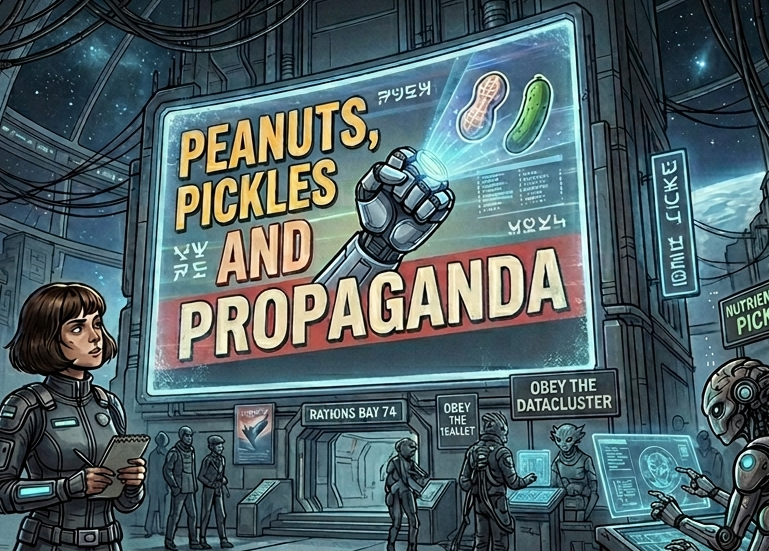
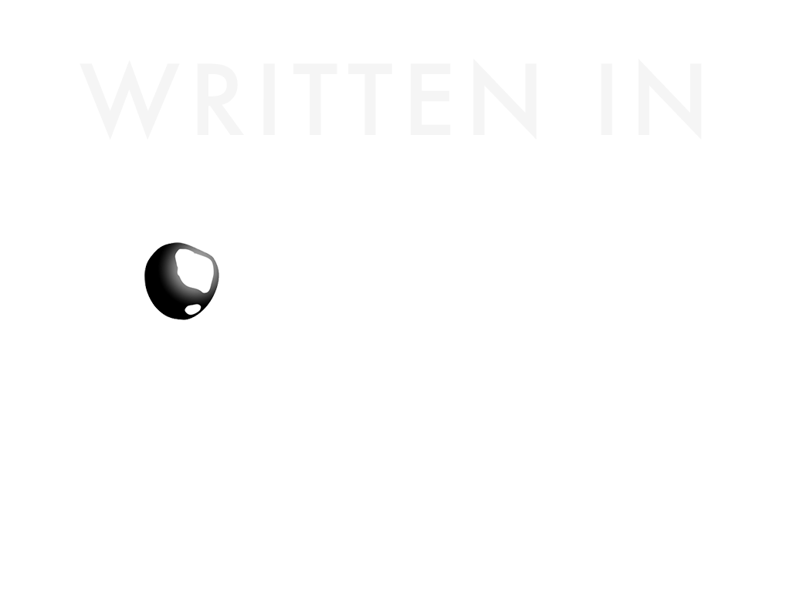

Peanuts, Pickles and Propaganda
===============================
|CC| |Itch| |Ink|

.. |CC| image:: https://img.shields.io/badge/License-CC%20BY%204.0-lightgrey.svg
    :target: http://creativecommons.org/licenses/by/4.0/

.. |Ink| image:: https://img.shields.io/badge/Ink-BA372C.svg
    :target: https://www.inklestudios.com/ink/

.. |Itch| image:: https://img.shields.io/badge/Itch.io-fa5c5c.svg
   :target: https://myleftgoat.itch.io/peanuts?secret=tCdbpYkFwZN7mvBSusfiKRDbE

Overview
--------

Peanuts, Pickles and Propaganda is a work of interactive fiction created for fun and 
presented for your amusement by Randall Frank and Andrew Florance.
It is written using a modified copy of the `Ink <https://www.inklestudios.com/ink/>`_ framework.

How this came about
~~~~~~~~~~~~~~~~~~~

This story had been sloshing around in various forms for several years. Having finished the Heresy games, we started looking for a new interactive fiction project that was not so closely tied to the T.I.M.E Stories structure.  Peanuts started as a varied collection of semi-humorous short story ideas. Gradually, an overarching story emerged, and this is the result.

What is it exactly?
~~~~~~~~~~~~~~~~~~~

There are four distinct endings to the story, depending on paths one choses to take.  Unlike games like Heresy, there are no "fetch quests" or "puzzles" to solve. Peanuts is at its core, a collection of short stories and we encourage readers to dabble a bit in all of them. 

General Comments
~~~~~~~~~~~~~~~~

Please note that Peanuts is largely a work of satire, and we hope one reads it in that light. While still being entirely fictional, there is not an insignificant amount autobiographical material here, so if one were looking to see what makes us tick (e.g. if you don't know my favorite joke by the end, you might want to try a different ending).  Finally, we do enjoy a good non-sequitur and obscure references to people and things. We assure you that all of them are safe to look up.

Building
--------

Requirements
~~~~~~~~~~~~

- Python 3.10 or higher for organizing the build and acting as a local web server.
- Inklecate CLI tool for building the story JSON representation.
- (Optional) Inky GUI tool for editing the story.  One can use Visual Studio Code as well.

Building
~~~~~~~~

Start by creating a Python virtual environment and install all the necessary
dependencies:

.. code:: Powershell

    pip install virtualenv
    python -m virtualenv venv
    ./venv/Scripts/activate.ps1   # for Windows PowerShell, different for other shells
    pip install -r requirements.txt

To build the web-based version of the story, the 
`Inklecate <https://github.com/inkle/ink/releases>`_ compiler needs to be
available.  The `build.py` script will attempt to download the
compiler from github when building the story.   

If you have a locally installed inklecate compuled, it can be used by 
setting the environmental variable *PEANUTS_INKLECATE* to the complete 
pathname of the executable.
A Powershell example if you downloaded the CLI tools yourself:

.. code:: Powershell

    $Env:PEANUTS_INKLECATE = "E:\inklecate_windows\inklecate.exe"
    & $Env:PEANUTS_INKLECATE
    Usage: inklecate <options> <ink file> ...

In most cases you can just run the command `python build.py build`
and the tools will be downloaded into the directory `ink_tools`.

*build.py* has several options:

- clean

  - Remove the contents of the `build` directory.

- build, fullbuild

  - rebuild the entire `build` directory. This does a `clean` followed by copying
    the contents of the `src/html` and `src/media` directories into `build`.  Finally,
    it does a `build` which regenerates the story Javascript file.

- serve [--port {portnumber}] [--nobrowser]

  - This option starts a web server that serves up the contents of the `build`
    directory on the selected port.  This simulates an actual web deployment. The
    default port is 9000.  By default, a web browser tab will be opened to view 
    the story. `--nobrowser` may be used to suppress the opening of the tab.

- release

  - This will first execute a `build` operation, then create a zip file of the
    contents of the `build` directory.  It will generate a file named: `peanuts_vX.Y.Z.zip` where X.Y.Z is the current build version from version.txt.  The resulting
    zip file can be served to run the game.  It can be used on platforms like
    `itch.io <https://itch.io>`_.

Running
~~~~~~~

One can use the `build.py` file to build and run the story:

.. code:: Powershell

    > python build.py build
    INFO:peanuts_build:Story version: 0.0.1
    INFO:peanuts_build:File 'ink_tools\inklecate_windows.zip' downloaded successfully from 'https://github.com/inkle/ink/releases/download/v.1.2.0/inklecate_windows.zip'
    INFO:peanuts_build:All files extracted from 'ink_tools\inklecate_windows.zip' to 'ink_tools'.
    INFO:peanuts_build:{"compile-success": true}
    {"issues":[]}{"export-complete": true}

    INFO:peanuts_build:Operation complete

    > python build.py serve
    Serving story:  http://127.0.0.1:9000

At this point, a browser tab will be opened, pointing to: ``http://127.0.0.1:9000``
in which the story may be played.

.. note::

    If one double-clicks on the `index.html` file in the `build` directory to
    view the story, the background sound will not work due to CORS issues as the background sound files are accessed via fetch() calls.

Versioning
~~~~~~~~~~

The game has a semantic version number of the form: 'x.y.z'.  This is specified by the file 'version.txt'
in the source code.  This version number is also stored in game 'save' files, which are
basically a snapshot of the current ink engine instance, taken just before the current
knot is displayed.  Note: all fields can be multiple digits in length, so '0.3.12' is valid.

Any time there is a change to the overall state structure (e.g. a new knot/stich is
added or a new item/variable is introduced), one must bump the x or y portion of the
semantic version.  The save file loader will allow files that differ only in the 'z' digits
to be loaded w/o warning.  So change like spelling, text revisions, etc should only update
the 'z' field to retain backward compatibility with old save files.

License
-------

This work is licensed under a Creative Commons Attribution 4.0 International license and is
copyright (C) 2026 Andrew Florance and Randall Frank.

.. image:: https://i.creativecommons.org/l/by/4.0/88x31.png
   :alt: License-CC

----

